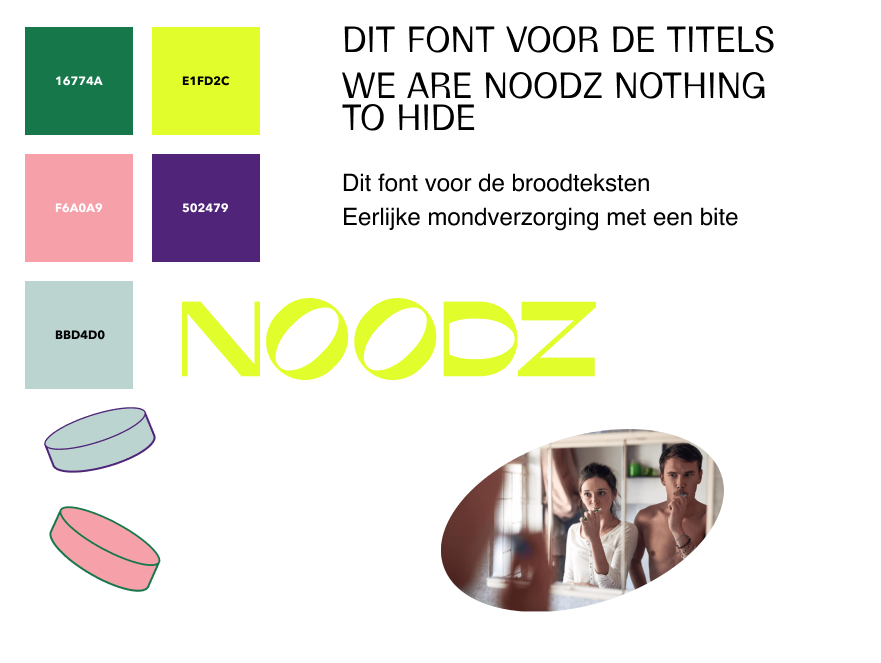
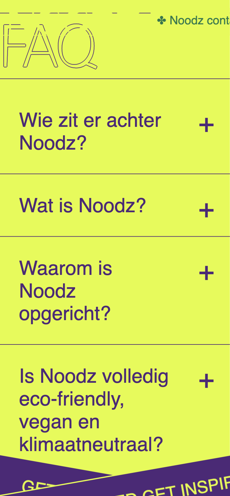
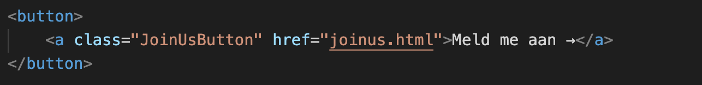
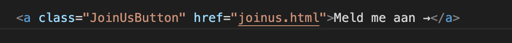

# Procesverslag
Markdown is een simpele manier om HTML te schrijven.  
Markdown cheat cheet: [Hulp bij het schrijven van Markdown](https://github.com/adam-p/markdown-here/wiki/Markdown-Cheatsheet).

Nb. De standaardstructuur en de spartaanse opmaak van de README.md zijn helemaal prima. Het gaat om de inhoud van je procesverslag. Besteedt de tijd voor pracht en praal aan je website.

Nb. Door *open* toe te voegen aan een *details* element kun je deze standaard open zetten. Fijn om dat steeds voor de relevante stuk(ken) te doen.

## Jij

uitwerken voor kick-off werkgroep

### Auteur:
Shai Cohen

#### Je startniveau:
Blauw

#### Je focus:
Surface plane
 

## Je website

uitwerken voor kick-off werkgroep

### Je opdracht:
https://www.wearenoodz.com/

#### Screenshot(s) van de eerste pagina (small screen): 
homepagina  

#### Screenshot(s) van de tweede pagina (small screen):
Join us pagina

 

## Breakdownschets (week 1)

uitwerken na afloop 2e werkgroep

### de hele pagina: 

### dynamisch deel (bijv menu): 

## Voortgang 1 (week 2)

uitwerken voor 1e voortgang

### Stand van zaken
hier dit ging goed & dit was lastig (neem ook screenshots op van delen van je website en code)

Ik ben deze week begonnen met het schrijven van mijn html. Ik merk dat het wel weer even wennen is, omdat ik het al een tijdje niet heb gedaan. Gelukkig heb ik veel aan de breakdown schets en kom ik daardoor aleen heel eind inde structuur van de html.

Zodra ik een eind ben met de html begon ik alvast met het begin van css. Dit deed ik metbehulp van een huisstijl kladblok, wat ik snel had gemaakt. Dit hielp me met de fonts, kleuren en plaatjes. 

## Voortgang 2 (week 3)

uitwerken voor 2e voortgang

### Stand van zaken
Ik merkte afgelopen week dat ik een beetje moeite had met mijn motivatie voor dit vak. Dit komt denk ik, omdat ik het privé ook druk heb en we ook een deadline hadden van vormgeving. Ik was vorige week al begonnen met de css, maar dit was nog heel minimaal. Deze week heb ik  me vooral gefocust op het huiswerk om weer onder de knie te krijgen hoe bijvoorbeeld flexbox werkte.. of positions etc. Ik heb dit gelijk toegepast in mijn website en heb bijvoorbeeld op de header een position fixed gezet, zodat die meescrollt naar onder. 

## Toegankelijkheidstest (week 4)

uitwerken na test in 3e voortgang

### Bevindingen
Lijst met je bevindingen die in de test naar voren kwamen:

-Hemianopia: Alles is duidelijk te zien, weinig verschil met wanneer je geen bril op hebt. 

-Hemifield loss: Alles is prima te lezen, maar de header valt weg bij de gele achtergrond

-screenreader buttons/link

-screenreader img

-screenreader tekst

#### Hemianopia: Alles is duidelijk te zien, weinig verschil met wanneer je geen bril op hebt. 
Dit gaat eigenlijk heel erg goed en hoeft niet per see wat aan veranderd te worden. 

#### Hemifield loss: Alles is prima te lezen, maar de header valt weg bij de gele achtergrond
De header valt weg zodra we aankomen bij de section faq. Dit komt omdat de header geel is, maar de achetrgrond ook. 

#### Screenreader: buttons &  linkjes 
Tijdens de test met de screenreader, kwam ik erachter dat wanneer we bije en button aankwamen er eerst gezegd wordt button: content en daarna > link: content... hierdoor maakt het voor de gebruiker redelijk vaag. Dit probleem is gemakkelijk op te lossen door alle buttons gewoon te vervangen  door een a tag

#### Screenreader: img
Tijdens de test kwam ik er ook achter dat mijn adbeelding geen beschrijvingen hebben. Dit maakt het voor de grbuiker die met screenreader leest erg moeilijk te begrijpen of de afbeelding nodig is. Toen ik de screenreader test op de echte website deed zag ik dat zij hier wel gebruik van maken. Dit probleem is gelukkig heel makkelijk op te lossen door in elke img tag bij alt een beschrijving te plaatsen.

#### Screenreader: tekst
Uit mijn feedback van Jochem, die de test ook deed op mijn website kwam naar voren dat de tekst op  de website niet voorgelezen wordt. Alleen buttons worden voorgelzen. Toen ik het zelf probeerde deed die het wel. Wat ik hieraan kan doen weet ik niet heel goed, maar ik kan proberen het op meerder computers te testen om te kijken of het verschillend is. 

## Voortgang 3 (week 4)

uitwerken voor 3e voortgang

### Stand van zaken
ik heb deze week een enorme sprong gemaakt met mijn  website. Het ziet er langzamerhand steeds identieker uit en de annimaties maken de website nog leuker om naar te kijken. Ik ben gaan spelen met de animaties in de header, footer en op de socials page. Dit heb ik gedaan met behulp van de opdrachten uit de les. 

Wel merk ik dat ik veel moeite heb met javascript. Ik heb vorig jaar het vak inleiding programmeren goed afgerond, alleen merk  dat ik toch wel veel ben vergeten. Ik merk dat ik het heel frustrerend vind als ik denk dat iets werkt en dat het dan niet lukt.. Eindstand kom je er ook achter dat het dan om een klein foutje zoals een typfoutje komt, en dan ben je redelijk wat tijd verloren daardoor.  

Voor  de rest heb ik tijdens de voortgangsgesprekken goede feedback gekregen en werd er gezegd dat ik goed op schema zit. Dit is dan wel weer motiverend gelukkig! Komende week ga ik weer volle bak aan javascript en de laatste puntjes op de i en dan ben ik klaar voor de beoordeling. 

## Eindgesprek (week 5)

uitwerken voor eindgesprek

### Stand van zaken
hier dit ging goed & dit was lastig (neem ook screenshots op van delen van je website en code)

### Screenshot(s)

hier screenshot(s) van je eindresultaat

## Bronnenlijst

continu bijhouden terwijl je werkt

Nb. Wees specifiek ('css-tricks' als bron is bijv. niet specifiek genoeg).

1. bron 1
2. bron 2
3. ...

